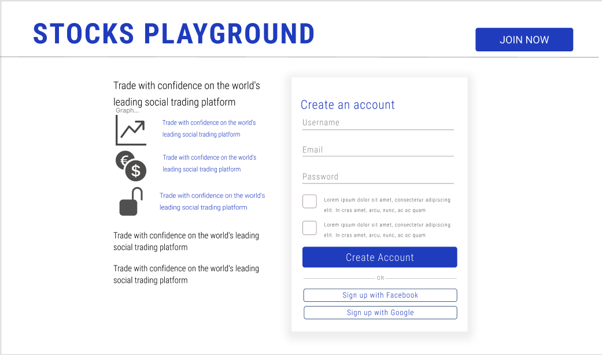
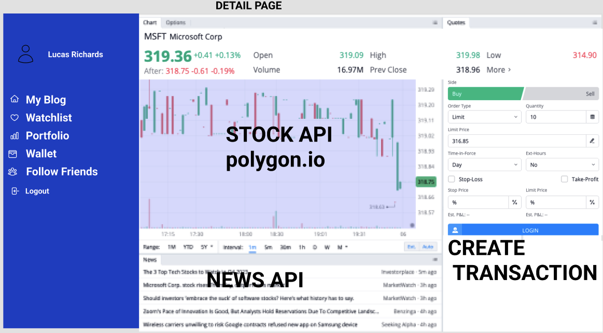
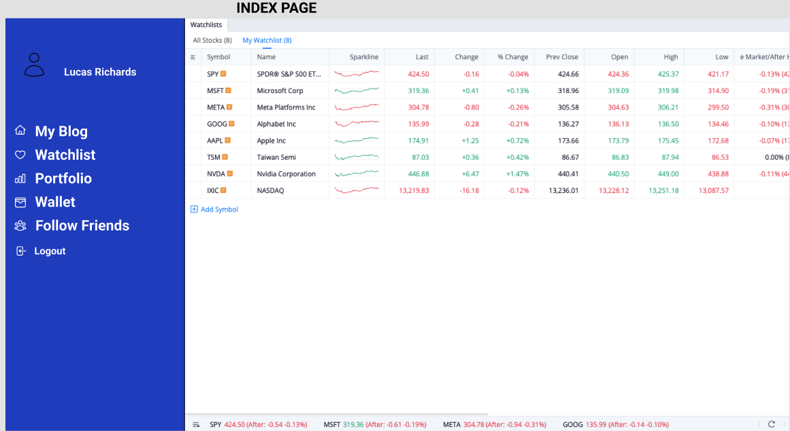
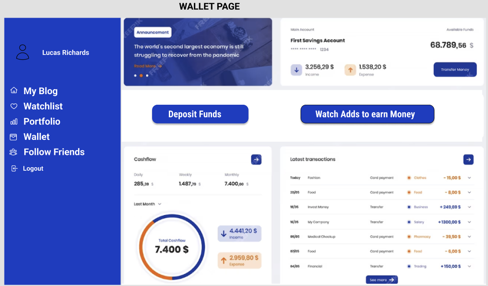

# Stock Playground API

This is the frontend for the full stack stock app for anyone that wants to practice stock exchange for free and no risk.

## Technologies Used

- Express.js
- React.js
- Node.js
- Bootstrap

#### User Stories

AAU I want to...
- Add stocks to my watchlist
- See a list of all stocks
- See a list of the stocks I invested in
- See a single stock history
- delete a stock from watchlist
- create a transaction to buy/sell a stock
- see a list of all my transactions
- create a comment for a transaction
- update a comment
- delete a comment

### Wireframes

